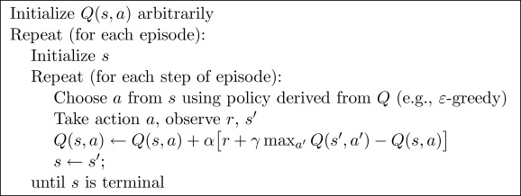

# RL学习（基于GYM）

## 环境准备 
- 安装
```
pip install gym
```

## 参考教程
- 视频教程
  - L1: [Gymnasium (Deep) Reinforcement Learning](https://www.youtube.com/playlist?list=PL58zEckBH8fCt_lYkmayZoR9XfDCW9hte) [代码](https://github.com/johnnycode8/gym_solutions)
  - L2: 很好的图文解释RL视频系列：[Reinforcement Learning from scratch](https://www.youtube.com/watch?v=vXtfdGphr3c)
  - L3: 中文系列教程（涵盖各类算法）：[什么是强化学习? (Reinforcement Learning)](https://www.youtube.com/watch?v=NVWBs7b3oGk&list=PLXO45tsB95cJYKCSATwh1M4n8cUnUv6lT) [代码](https://github.com/MorvanZhou/Reinforcement-learning-with-tensorflow)

## 概念学习
- 基本概念
  <details><summary><strong>on-policy和off-policy</strong></summary>

  策略更新方法可以分为两类：On-policy（在线策略）和Off-policy（离线策略）。它们之间的主要区别在于如何使用经验（状态、动作、奖励和下一个状态）来更新智能体的策略。

  on-policy：行动策略和目标策略是同一个策略  
  off-policy：行动策略和目标策略不是同一个策略

  什么是行动策略和目标策略？  
  行动策略：就是每一步怎么选动作的方法，它产生经验样本  
  目标策略：我们选什么样更新方式，去寻找最好的Q表

  </details>

  <details><summary><strong>MDP(Markov Decision Process)</strong></summary>

  ‌马尔可夫决策过程（Markov Decision Process, MDP）‌是一种用于描述智能体在随机环境中做出决策的数学模型。它基于马尔可夫链（马尔可夫链‌是一种特殊的随机过程，具有“无记忆”的性质，即未来的状态仅与当前状态有关，而与过去的状态无关。这种特性被称为马尔可夫性质。‌），并在此基础上引入了动作和策略，使得模型能够更准确地反映智能体与环境交互的过程。MDP的核心要素包括状态（S）、动作（A）、策略（π）和奖励（R），以及折扣因子（γ）。

  </details>

  <details><summary><strong>Bellman方程</strong></summary>

  贝尔曼方程（Bellman Equation），也称作‌动态规划方程（Dynamic Programming Equation），是动态规划方法能够达到最佳化的必要条件。

  贝尔曼方程将“决策问题在特定时间的值”以“来自初始选择的报酬与从初始选择衍生的决策问题的值”的形式表示。通过这种方式，动态最佳化问题被分解成简单的子问题，这些子问题遵循贝尔曼提出的“最佳化还原理”。

  </details>
- 常见算法
  <details><summary><strong>Q-Learning</strong></summary>

  [Q-Learning](https://blog.csdn.net/qq_74722169/article/details/136822961)（或者叫Q-networks、Value networks）是一种经典的强化学习算法，用于解决马尔可夫决策过程（Markov Decision Process，MDP）中的控制问题。它是基于值迭代（Value Iteration）的思想，通过估计每个状态动作对的价值函数Q值来指导智能体在每个状态下选择最佳的动作。
  
  其算法的基本思想跟主要优势如下：Q-Learning是强化学习算法中value-based的算法，Q即为Q（s，a），就是在某一个时刻的state状态下，采取动作a能够获得收益的期望，环境会根据agent的动作反馈相应的reward奖赏，所以算法的主要思想就是将state和action构建成一张Q_table表来存储Q值，然后根据Q值来选取能够获得最大收益的动作。
  
  Q-learning的主要优势就是使用了时间差分法（融合了蒙特卡洛和动态规划）能够进行off-policy的学习，使用贝尔曼方程可以对马尔科夫过程求解最优策略。

  简介：Q-Learning是一种无模型的强化学习算法，通过学习动作值函数（Q函数）来选择最优动作。
  特点：不需要环境的动态模型，可以直接从与环境的交互中学习（自我思考：这里是优点也是缺点！如果环境是动态变化的，则训练效果可能并不好，训练结果并不收敛）。
  应用场景：适用于离散状态和动作空间的问题。

  <div align="center">
  
  </div>

  </details>

  <details><summary><strong>SARSA(State-Action-Reward-State-Action)</strong></summary>

  简介：SARSA也是一种无模型的算法，但它更新的是当前策略下的Q值，而不是贪婪策略下的Q值。
  特点：SARSA是on-policy算法，而Q-Learning是off-policy算法。
  应用场景：适用于需要考虑当前策略的情况下。

  </details>

  <details><summary><strong>DQN(Deep Q-Network)</strong></summary>

  简介：DQN结合了Q-Learning和深度神经网络，用于处理高维状态空间。
  特点：使用经验回放（Experience Replay）和目标网络（Target Network）来稳定训练过程。
  应用场景：适用于图像处理和复杂的高维状态空间问题，如 Atari 游戏。

  </details>

  <details><summary><strong>Policy Gradients</strong></summary>

  简介：Policy Gradients直接优化策略参数，而不是学习价值函数。
  特点：适用于连续动作空间的问题。
  常见算法：REINFORCE、Actor-Critic、Proximal Policy Optimization (PPO)。
  应用场景：适用于需要连续动作输出的问题，如机器人控制。

  </details>

  <details><summary><strong>Actor-Critic</strong></summary>

  简介：结合了价值方法和策略梯度方法，同时学习策略（Actor）和价值函数（Critic）。
  特点：通过Critic提供更精确的梯度估计，加速学习过程。
  应用场景：适用于需要快速收敛和稳定性的任务。

  </details>

  <details><summary><strong>A3C(Asynchronous Advantage Actor-Critic)</strong></summary>

  简介：A3C是一种并行化的Actor-Critic方法，允许多个智能体并行地与环境交互。
  特点：通过并行化加速学习过程，提高样本效率。
  应用场景：适用于需要大规模并行计算的复杂任务。

  </details>

  <details><summary><strong>PPO(Proximal Policy Optimization)</strong></summary>

  [PPO](https://blog.csdn.net/niulinbiao/article/details/134081800) 算法之所以被提出，根本原因在于 Policy Gradient 在处理连续动作空间时 Learning rate 取值抉择困难。Learning rate 取值过小，就会导致深度强化学习收敛性较差，陷入完不成训练的局面，取值过大则导致新旧策略迭代时数据不一致，造成学习波动较大或局部震荡。除此之外，Policy Gradient 因为在线学习的性质，进行迭代策略时原先的采样数据无法被重复利用，每次迭代都需要重新采样；同样地置信域策略梯度算法（Trust Region Policy Optimization，TRPO）虽然利用重要性采样（Important-sampling）、共轭梯度法求解提升了样本效率、训练速率等，但在处理函数的二阶近似时会面临计算量过大，以及实现过程复杂、兼容性差等缺陷。而PPO 算法具备 Policy Gradient、TRPO 的部分优点，采样数据和使用随机梯度上升方法优化代替目标函数之间交替进行，虽然标准的策略梯度方法对每个数据样本执行一次梯度更新，但 PPO 提出新目标函数，可以实现小批量更新。

  </details>

  <details><summary><strong>DDPG(Deep Deterministic Policy Gradient)</strong></summary>

  简介：Deep Deterministic Policy Gradient (DDPG)算法是DeepMind团队提出的一种专门用于解决连续控制问题的在线式(on-line)深度强化学习算法，它其实本质上借鉴了Deep Q-Network (DQN)算法里面的一些思想。
  特点：DDPG算法是Actor-Critic (AC) 框架下的一种在线式深度强化学习算法，因此算法内部包括Actor网络和Critic网络，每个网络分别遵从各自的更新法则进行更新，从而使得累计期望回报最大化。
  应用场景：适用于连续控制问题比如机器人的姿态控制等场景。

  </details>

## 自我思考
  <details><summary><strong>强化学习与深度学习的差异</strong></summary>

  <strong>深度学习</strong>  
  核心概念：  
  深度学习是机器学习的一个子集，它基于深层神经网络的架构。这些网络模仿人类大脑的工作方式，通过多个层次的信息处理层进行学习。  
  主要用于处理和学习大量的数据，特别擅长于识别数据中的模式和特征，如图像、声音和文本数据。  
  训练方式：  
  通常使用监督学习，即模型通过大量的标记数据（已知输入和输出）进行训练。  
  训练目标是最小化预测输出和实际输出之间的差距。
  
  <strong>强化学习</strong>  
  核心概念： 
  强化学习是一个学习决策序列的框架，其中学习者（称为智能体）必须通过尝试和错误来决定如何达到目标。  
  智能体在环境中执行动作，并根据执行的动作的结果获得奖励或惩罚。智能体的目标是最大化其获得的总奖励。  
  训练方式：  
  主要使用试错方法和奖励反馈。智能体与环境交互，通过环境反馈来调整其策略。  
  不依赖于大量标记数据，而是通过智能体与环境的交互学习最佳策略。
  
  <strong>差异与互补</strong>    
  强化学习有多种实现算法，比如[Q-Learning](https://www.youtube.com/watch?v=HTZ5xn12AL4)算法，它通过学习状态和动作的价值函数来决定最佳行动，核心是基于动作空间和状态空间的Q价值表（Q函数）而不是深度学习的神经网络。而[深度强化学习](https://www.youtube.com/watch?v=nOBm4aYEYR4)（如Deep Q-Networks, DQN）则结合了深度学习和强化学习的优点，使用深度神经网络来近似Q函数。

  </details>

## Interesting Stuffs
  - [Teaching Robots to Walk w/ Reinforcement Learning](https://www.youtube.com/watch?v=6qbW7Ki9NUc) [代码](https://github.com/Sentdex/TD3-Bittle) [硬件: Petoi Bittle robot](https://www.petoi.com/pages/bittle-smart-robot-dog-model-overview)
  - [Deep Reinforcement Learning for Walking Robots(Matlab with DDPG)](https://www.youtube.com/watch?v=6DL5M9b2j6I)
  - [Robotic Arm Manipulation with Reinforcement Learning(Pytorch, TD3, and Robosuite)](https://www.youtube.com/watch?v=z1Lnlw2m8dg&list=PLOkmXPXHDP22VQmr37DFuJr6k30setQ2w)
  - [Autonomous Navigation with Deep Reinforcement Learning Using ROS2](https://www.youtube.com/watch?v=KEObIB7RbH0)